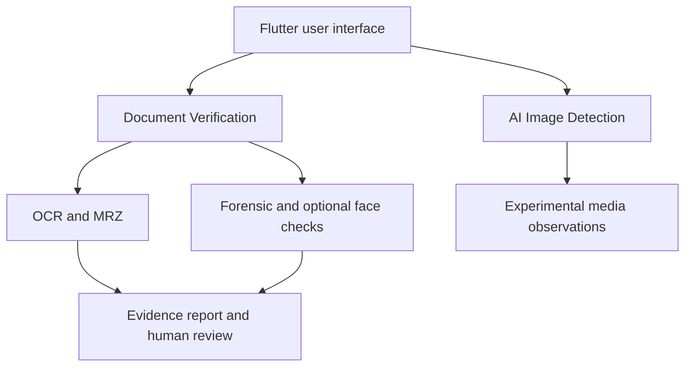

# Architecture and scope

**Document Verification** maps to the PS's four modules: OCR Extraction, Document Validation (product label: Document Verification), Tampering Detection, and Face Verification. Actual `POST /v1/screen` results are observations and an `inconclusive` or `manual_review` status. Field/MRZ comparisons and optional face models run separately; they do not feed a single trained fraud classifier.

**AI Image Detection** uses `POST /api/v1/detect/image`. The narrow whole-image classifier and optional visual/deepfake models provide research observations. The current document route explicitly does **not** run whole-image generation analysis and reports deepfake as `not_implemented` in that route. Reusing the media service for carefully scoped document-photo analysis is a future design option, not an implemented integration in this snapshot.

`POST /v1/review` can record an operator's action in a local demo log. There is no authorized government database adapter, validated unified risk score or deployment identity decision. The architecture can later allow an officer-facing localhost website while retaining a Flutter visual prototype; the captured repository contains Flutter source, not that website.

## Data handling

This is a local research demo. Only synthetic or consented images should be used. Keep credentials, model binaries, private IDs and biometric images outside Git. The local token is a demo gate, not a production authentication system. A private GitHub repository still exposes files to its collaborators.
