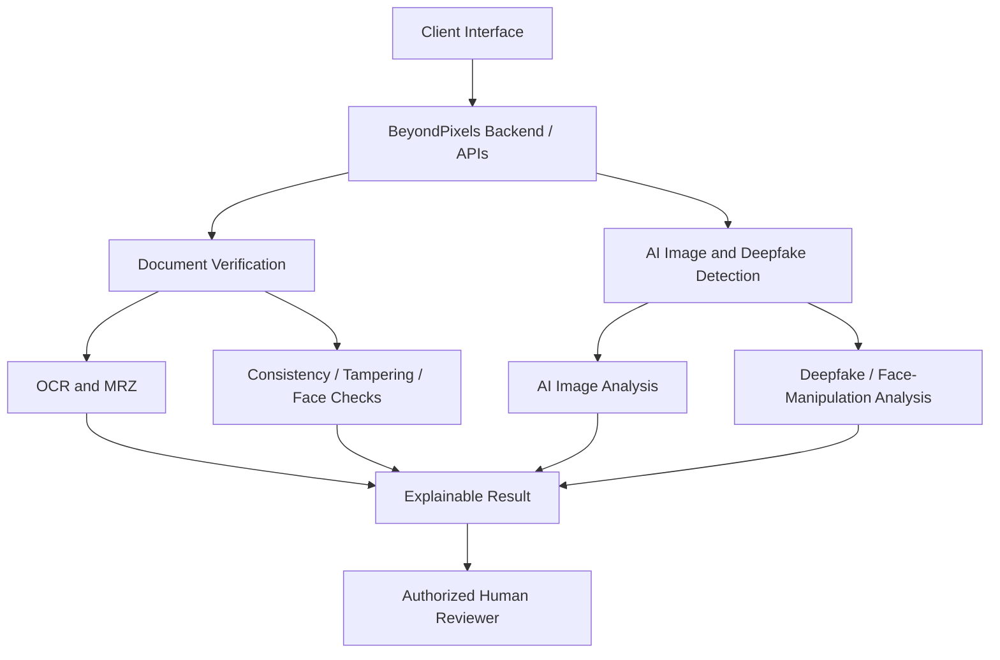

# Architecture and Scope

## Document Verification

Document Verification covers the document-focused workflow, including OCR extraction, MRZ processing, printed-field consistency, date checks, tampering indicators, and optional face comparison.

Each check remains separately explainable so the reviewer can understand what evidence contributed to the result.

## AI Image and Deepfake Detection

This is a separate media-analysis branch for AI-generated images and face/deepfake manipulation.

The branch is intentionally separate from Document Verification because an AI-generated-image score is not equivalent to document-authenticity verification.

## Human Review Layer

BeyondPixels is designed to provide evidence to the reviewer, including:

- which checks completed
- which checks were unavailable
- what information was extracted
- which inconsistencies were found
- which forensic indicators contributed to the result
- whether further manual review is recommended

## Interface Layer

The current prototype includes a Flutter mobile interface connected to the common backend architecture. Additional interfaces can be added later without duplicating the core verification and detection logic.

## Deployment Direction

A future authorized deployment can place the processing layer on secure or on-premise infrastructure while allowing approved clients at checkpoints or government facilities to access it through controlled APIs.

Protected government records should be accessed only through authorized integration services with authentication, authorization, logging, and appropriate data-handling controls.

## Data Handling

Only fictional, synthetic, or properly authorized samples should be used in demonstrations and testing.

Credentials, production tokens, real identity records, private biometric data, restricted datasets, and protected endpoints must remain outside the public repository.
